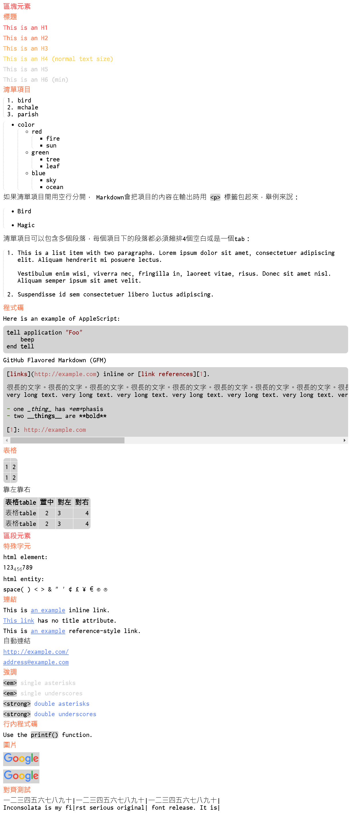

# monkeydown

For browsing local markdown file, converting through Tampermonkey and some local javascript and css file.

## usage

1. Download this repository, put it in the path you want. (for example `C:\monkeydown\` and used following)
2. In Chrome, add the extension "TamperMonkey".
3. In Chrome, goto the `chrome://extensions/` find "TamperMonkey" and be checked "Allow Access to File URLs"
4. In TamperMonkey, add a new UserScript with content of `src\tampermonkey.js`
5. In the new UserScript, edit the following path to the right path.
  ``` js
  // @resource     MD_CSS file:///C:\monkeydown\src\monkeydown.css
  // @require      file:///C:\monkeydown\src\monkeydown.js
  ```
6. Done. you can browsing local markdown file directly with Chrome now.

## example


